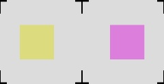

# MoverioStereo

Author: Long Qian<br>
Copyright: LCSR, Johns Hopkins University<br>
This application is demo of 3D display using [OpenGL ES](https://www.khronos.org/opengles/) on Moverio BT200.

## What's special
__In Android, one activity can hold only one__ [__GLSurfaceView__](http://developer.android.com/reference/android/opengl/GLSurfaceView.html) __with one renderer__.
The 3D mode of Moverio BT200 simply splits the screen and displays the left half on left screen and right half on right screen (scaling the width by 2).
[__Render To Texture__](http://www.opengl-tutorial.org/intermediate-tutorials/tutorial-14-render-to-texture/) helps to create two separate scenes with one GL handle.

## Moverio BT200 3D Mode
If a 2D display looks like this:
<center></center>

Then, in 3D mode, image for left screen and right screen will be:
<center></center>

The overall 3D effects will be like this (__not exactly__):
<center></center>

## Render Pipeline
1. Create two __FrameBuffer__ object
2. Setup the __FrameBuffer__, link them with two GL __Texture__ object
3. Create a scene consisting arbitrary objects
4. __Pass 1__: Render the scene with __GL_PROJECTION__ associated with first __FrameBuffer__.
5. __Pass 2__: Render the same scene to the second __FrameBuffer__.
6. Create a __dummy scene__, consisting two __Plane__ objects, binded with respective __Texture__ object. 
7. __Pass 3__: Render the __dummy scene__.

## Important Details
* For compatibility, only __GL10__ and __GL11ExtensionPack__ objects are used.
* Image dimension for __glTexImage2D__ should be __POWER OF TWO__ !!!
* Be sure to check frame buffer status after setting up.
* To enable 2D rendering, using following code:
``` java
gl.glViewport(0, 0, width, height);
# width and height should be equal to hardware dimension.
gl.glMatrixMode(GL10.GL_PROJECTION);
gl.glLoadIdentity();
gl.glOrthof(-width / 2, width / 2, -height / 2, height / 2, -1000f, 1000f);
```
* `x, y` offset in`glViewport` should be carefully chosen for __Pass 1__ and __Pass 2__, so that texture image (960, 492) is not scaled and be stored at the correct position in framebuffer (1024, 512).

